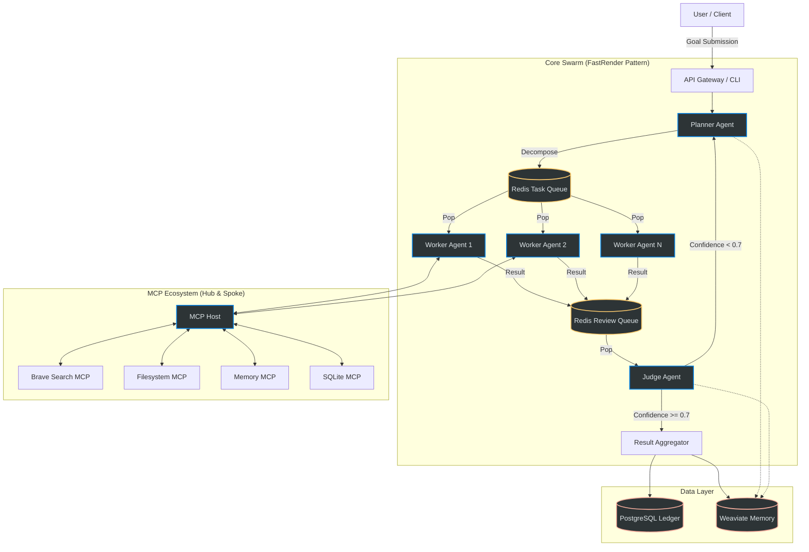

# Project Chimera Architecture Visualization

This document visualizes the "FastRender Swarm" architecture and the system topology for Project Chimera.

## High-Level System Architecture

## Data Flow & Protocol

1.  **Input**: Goal enters via API.
2.  **Planning**: `Planner` breaks goal into atomic `Tasks` (JSON).
3.  **Queuing**: Tasks pushed to `Redis Task Queue`.
4.  **Execution**: `Workers` claim tasks, use `MCP Tools` to execute.
5.  **Review**: Results pushed to `Redis Review Queue`.
6.  **Judgment**: `Judge` evaluates distinct output against acceptance criteria.
    *   **Pass**: Commit to `PostgreSQL` / Update `Weaviate`.
    *   **Fail**: Send feedback to `Planner` for replanning or retry.

## Component Roles

| Component | Responsibility | Tech Stack |
|:---|:---|:---|
| **Planner** | Strategic decomposition, dependency management. | Python, LLM |
| **Worker** | Tactical execution, tool usage. | Python, MCP Client |
| **Judge** | Quality assurance, safety checks, synthesis. | Python, LLM |
| **Redis** | High-speed message bus for async communication. | Redis 7 |
| **PostgreSQL** | Source of truth for ledgers, users, and final artifacts. | Postgres 15 |
| **Weaviate** | Semantic memory, RAG context. | Weaviate |
