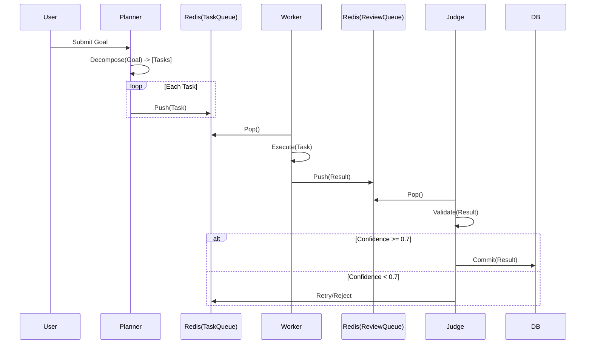

# Swarm Architecture: Detailed Specification

## 1. FastRender Swarm Pattern

The Chimera Factory uses a **FastRender Swarm** to parallelize task execution. This pattern decouples planning from execution and validation.

### Workflow
1.  **Decomposition (Planner)**: Goal -> [Task 1, Task 2, ...]
2.  **Execution (Worker Pool)**: Workers pick up tasks asynchronously.
3.  **Validation (Judge)**: Results are scored; high confidence (>0.7) merged, low confidence rejected.

### Sequence Diagram (Mermaid)



## 2. Component Implementation Details

### Planner (`src/chimera/planner.py`)
Responsible for breaking down goals using an LLM (Mocked in Phase 1).
```python
class Planner:
    def decompose(self, goal: str) -> List[Task]:
        # Uses LLM to split goal into atomic tasks
        pass
```

### Worker (`src/chimera/worker.py`)
Stateless execution units. Can scale horizontally (K8s pods).
```python
class Worker:
    def process_task(self, task: Task):
        # Executes task using tools
        pass
```

### Judge (`src/chimera/judge.py`)
Ensures quality and safety. Implements Optimistic Concurrency Control (OCC).
```python
class Judge:
    def evaluate(self, result: Result):
        # Checks confidence score & safety policy
        pass
```

## 3. MCP Integration
Project Chimera uses the **Model Context Protocol (MCP)** to connect with external tools.
- **Client**: `ChimeraMCPClient` connects via stdio/SSE.
- **Tools**: Search, Blockchain, Social APIs.

## 4. Database Topology
- **Redis**: Hot state (Queues).
- **PostgreSQL**: Durable state (Ledgers, Users).
- **Weaviate**: Semantic memory (Embeddings).

## 5. Agentic Commerce
Enabled via **Coinbase AgentKit**.
- **Wallets**: Non-custodial, one per agent.
- **Transactions**: Autonomous but budget-gated.
