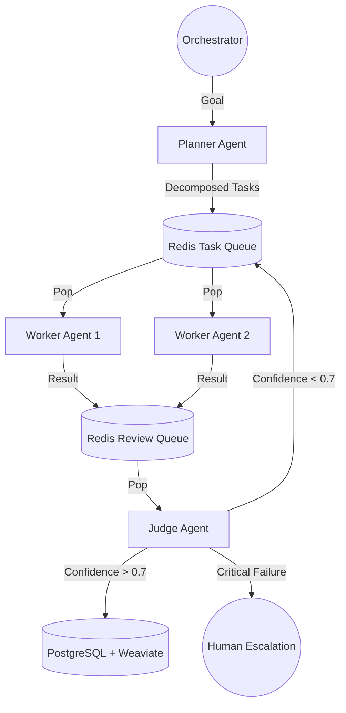

# Architecture Strategy: FastRender Swarm & Agentic Factory

## 1. Top-Level Topology
The system is architected as a **FastRender Swarm**, enabling high concurrency and self-healing properties for the Autonomous Influencer Network.

## 2. Agent Pattern Strategy
**Decision**: **Hierarchical Swarm** (FastRender) over **Sequential Chain**.
- **Rationale**: Sequential chains (A -> B -> C) start brittle; if step B fails, the whole chain halts. A Swarm pattern enables parallel execution (e.g., researching 5 distinct trends simultaneously) and redundancy (if Worker 1 crashes, the task remains in the queue for Worker 2). This aligns with the "Self-Healing" requirement in the SRS.

## 3. Human-in-the-Loop (HITL) Strategy
**Decision**: **Confidence-Gated Escalation**.
- **Location**: The **Judge** agent acts as the gatekeeper.
- **Logic**:
  - Confidence > 0.9: Autonomous Publish.
  - Confidence 0.7 - 0.9: Asynchronous Review (User sees it in dashboard but action proceeds).
  - Confidence < 0.7: **Blocker**. Task is flagged for manual "Orchestrator" approval.
- **Safety**: No content goes to public platforms (Twitter/YouTube) without passing the Judge's policy checks (embedded in Weaviate memory).

## 4. Data Topology Strategy
**Decision**: **Hybrid SQL + NoSQL + Vector**.
- **Why SQL (PostgreSQL)?**: Transactional integrity is non-negotiable for **Ledgers** (Agent finances) and **User State**. We cannot lose money or account data.
- **Why NoSQL (Redis)?**: High-velocity **Queues** (Task/Review) need sub-millisecond latency. Metadata for video processing (which is ephemeral during rendering) fits here.
- **Why Vector (Weaviate)?**: "Cognitive" recall. Agents need to search thousands of interactions to maintain persona consistency. SQL cannot do semantic search efficiently.

## 5. MCP Integration (Model Context Protocol)
- **Architecture**: Hub-and-Spoke.
- **Client**: Chimera Core acts as an MCP Client.
- **Servers**: External tools (Browsing, Social Media, Wallet) are accessed via MCP Servers.
- **Protocol**: Stdio/SSE connections.

## 6. Agentic Commerce
- **Integration**: Coinbase AgentKit.
- **Security**: Non-custodial wallets, ENV key management.
- **Logic**: CommerceManager handles budget checks and onchain ops.

## 7. HITL & Governance
- **Confidence Thresholds**: Low confidence (<0.7) triggers human escalation.
- **Traceability**: All actions logged to Tenx MCP Sense.
