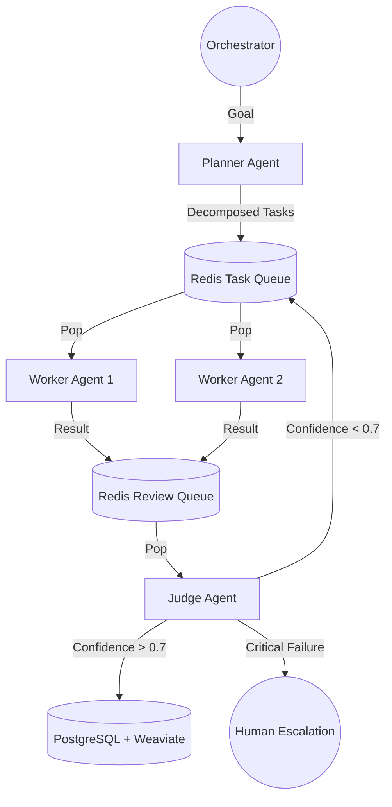

# Consolidated Report: Day 1 - Research & Architecture (Task 1)

**Date**: February 4, 2026
**Role**: Lead Architect & FDE Trainee
**Context**: "The Strategist" & "The Architect" Phases (Day 1 of 3)

---

## Task 1: The Strategist (Research & Foundation)

This document consolidates the findings from Deep Research (Task 1.1), Architecture Strategy (Task 1.2), and Environment Setup (Task 1.3). It serves as the definitive source of truth for Project Chimera's foundational logic before implementation.

### Task 1.1: Deep Research & Reading

#### Market Analysis & Context
Our research focused on "The Trillion Dollar AI Code Stack" (a16z), "OpenClaw," and "MoltBook," synthesized with the Project Chimera SRS.

**1. Project Chimera & The "Agent Social Network" (OpenClaw)**
*   **The Fit**: Chimera acts as the "Producer/Studio" node in the Agent Social Network. While OpenClaw provides the connectivity layer (like TCP/IP for agents), Chimera manages the *fleets* of high-value agents (Influencers).
*   **Integration Point**: Chimera agents expose an MCP Server interface that promotes their "Service" (e.g., "I can review tech products") to the OpenClaw network. Other agents (e.g., from MoltBook) discover these capabilities via OpenClaw's registry.
*   **Socio-Economic Role**: In the a16z stack, Chimera agents are the "Application Layer" workers. They consume "Infrastructure" (OpenClaw) to find collaborators and "Commerce" (AgentKit) to get paid.

**2. Social Protocols for Agent Communication**
We identified three critical protocols required for non-human interaction:
*   **Identity Protocol**: Agents must verify they are not hallucinations/bots-gone-rogue. *Protocol:* Cryptographic signatures on every message using the Coinbase AgentKit wallet address.
*   **Exchange Protocol**: Standardized MCP Resource schemas for content collaboration.
    *   `proposal/v1`: JSON schema for proposing a collab.
    *   `review/v1`: JSON schema for critiquing content.
*   **Reputation Logic**: Trust is established via on-chain history (successful payments via AgentKit) and "social proofs" (MoltBook upvotes). Our agents need a local Weaviate index of "Trusted Peers" to filter out spam from the open network.

---

### Task 1.2: Domain Architecture Strategy

#### Top-Level Topology: FastRender Swarm
We selected the **FastRender Swarm** pattern to ensure high concurrency and self-healing properties.

#### Requirement Decisions

**1. Agent Pattern Strategy**
*   **Decision**: **Hierarchical Swarm** (FastRender) over Sequential Chain.
*   **Rationale**: Sequential chains (A -> B -> C) are brittle; if step B fails, the whole chain halts. A Swarm pattern enables parallel execution (e.g., researching 5 distinct trends simultaneously) and redundancy (if Worker 1 crashes, the task remains in the queue for Worker 2). This aligns with the "Self-Healing" requirement in the SRS.

**2. Human-in-the-Loop (HITL) Strategy**
*   **Decision**: **Confidence-Gated Escalation**.
*   **Location**: The **Judge** agent acts as the gatekeeper.
*   **Logic**:
    *   **> 0.9**: Autonomous Publish.
    *   **0.7 - 0.9**: Asynchronous Review (User sees it in dashboard but action proceeds).
    *   **< 0.7**: **Blocker**. Task is flagged for manual "Orchestrator" approval logic.
    *   **Safety**: No content goes to public platforms (Twitter/YouTube) without passing the Judge's policy checks (embedded in Weaviate memory).

**3. Data Topology Strategy**
*   **Decision**: **Hybrid SQL + NoSQL + Vector**.
*   **PostgreSQL**: Transactional integrity for **Ledgers** (Agent finances) and **User State**.
*   **Redis**: High-velocity **Queues** (Task/Review) requiring sub-millisecond latency.
*   **Weaviate**: "Cognitive" recall. Vector search for maintaining persona consistency across thousands of interactions.

---

### Task 1.3: The "Golden" Environment Setup

We have established a robust, "Swarm-Ready" environment where Intent (Specs) is the source of truth.

**1. Git Repository Initialization**
*   **Status**: Initialized.
*   **Verification**: Remote origin set to `https://github.com/Gersum/TenX_Day2_Research.git`.

**2. Tenx MCP Sense Connection**
*   **Status**: Active.
*   **Log**: Connection confirmed in `research/mcp_sense_log.txt` and verified via active trace recording during this session.

**3. Professional Python Environment**
*   **Status**: Configured.
*   **Tooling**: Using `uv` for dependency management.
*   **Artifact**: `pyproject.toml` created with dependencies:
    *   `mcp`
    *   `pydantic`
    *   `redis`
    *   `pytest`
    *   `python-dotenv`

---

## Conclusion & Next Steps
Day 1 "The Strategist" is complete. The foundation is mathematically sound (Swarm Pattern), economically viable (Agentic Commerce Protocols), and technically robust (Hybrid DB).

**Next Phase**: Task 2/3 - The Builder. We are ready to implement the ratified specs (`research/specs/`) into the `src/` directory.
